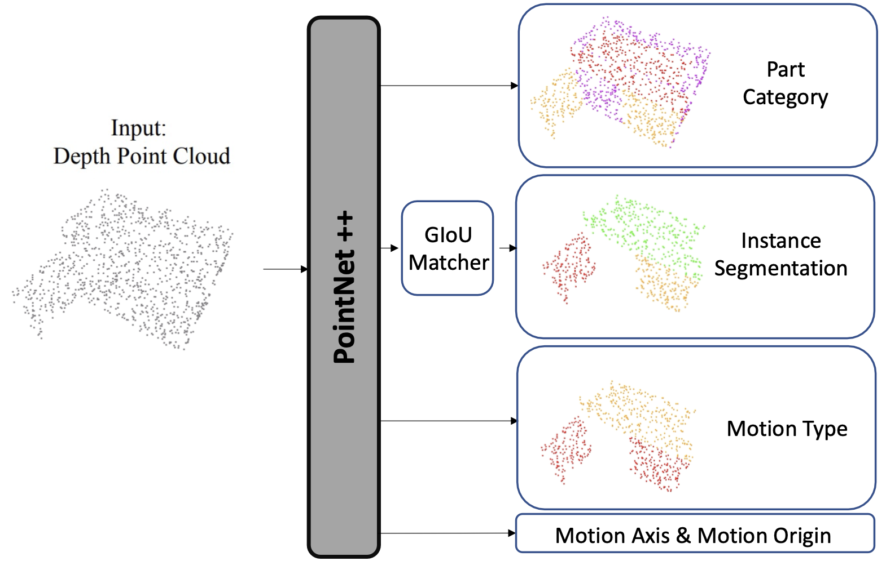

# OPDPN: Baseline in "OPD: Single-view 3D Openable Part Detection"

## Overview 
This repository contains the implementation of **OPDPN**, a simple baseline that detects openable parts and predicts their motion parameters from a single-view point cloud.
<p align="center"></p>

[Paper]()&nbsp; [Website](https://3dlg-hcvc.github.io/OPD/)

## Content
- [Additional Repo](Additional-Repo)
- [Setup](#Setup)
- [Dataset](#Dataset)
- [Pretrained Models](#Pretrained-Models)
- [Training](#Training)
- [Inference](#Inference)
- [Evaluation & Visualization](#Eveluation&Visualization)

## Additional-Repo

- OPD: We implement the OPDRCNN (main methods in this paper). For details, check the [OPD](https://github.com/3dlg-hcvc/OPD) repo.

- ANCSH: We reimplement the ANCSH method using PyTorch for the paper "Category-Level Articulated Object Pose Estimation". For details, check the [ANCSH-pytorch](https://github.com/3dlg-hcvc/ANCSH-pytorch) repo.

## Setup
The implementation has been tested on Ubuntu 20.04, with PyTorch 1.7.1, CUDA 11 and CUDNN 8.0.3.

* Clone the repository
```sh
git clone git@github.com:3dlg-hcvc/OPDPN.git
```
* Setup python environment
```sh
conda create -n opdpn python=3.7 
conda activate opdpn  
pip install -r requirements.txt
pip install "git+git://github.com/erikwijmans/Pointnet2_PyTorch.git#egg=pointnet2_ops&subdirectory=pointnet2_ops_lib"
```
(If meeting `unauthenticated git protocol on port 9418` ), run `git config --global url."https://".insteadOf git://` for above last command to install pointnet2_ops_lib)

## Dataset
You can download our `[OPDSynth]`(dataset) and `[OPDReal]`(dataset_real) [datasets](https://aspis.cmpt.sfu.ca/projects/motionnet/opd/dataset/OPDPN/dataset.tar.gz) for OPDPN to **./dataset** folder (there is one dataset.tar.gz under /dataset/OPDPN).

## Pretrained-Models
You can download our pretrained [models](https://aspis.cmpt.sfu.ca/projects/motionnet/opd/models/OPDPN/models.tar.gz) to **./models** folder (there is one models.tar.gz under /models/OPDPN).

Models for OPDSynth start with `Synth`, for OPDReal start with `Real`

`[OPDPN]`

## Training
To train from the scratch, you can use below commands.

* Train the only_det model (only train the detection and segmentation) -> only det model has no difference for OPDRCNN-O or -C.
  ```sh
  python train.py \
  --train_path <PATH_TO_TRAIN> \
  --test_path <PATH_TO_TEST> \
  --output_dir train_output
  ```
  * Dataset:
    * OPDSynth:
      * --train-path `dataset/dataset/train.h5`
      * --test-path `dataset/dataset/val.h5`
    * OPDReal:
      * --train-path `dataset/dataset_real/train.h5`
      * --test-path `dataset/dataset_real/val.h5`

## Inference
Inference with pretrained model, or your own trained model on val set

```sh
python train.py \
--train_path <PATH_TO_TRAIN> \
--test_path <PATH_TO_TEST> \
--output_dir test_output \
--test \
--inference_model <PPRETRAINED_MODEL>
```

* Dataset needs the same options as above

## Evaluation&Visualization
We convert the results into [OPD](git@github.com:3dlg-hcvc/OPD.git) inference results format, evalaute and visualize using the code from [OPD](git@github.com:3dlg-hcvc/OPD.git)

* Finalize the results
  * Synth Data
    ```
    python finalize_result.py \
    --result_path <PATH_TO_RESULT> \
    --output test_output
    ```
  * Real Data
    ```
    python finalize_result_real.py \
    --result_path <PATH_TO_RESULT> \
    --output test_output
    ```
  The <PATH_TO_RESULT> is the `inference_result.h5` after running inference.

* Get the `final_result.h5`, and conver the results into OPDRCNN format (Use the code from [OPD](git@github.com:3dlg-hcvc/OPD.git)). Need to download the dataset for OPDRCNN in [OPD](git@github.com:3dlg-hcvc/OPD.git).)
  ```
  python <PATH_TO_OPD>/PC_convert_results.py \
  --result-path <PATH_TO_FINAL_RESULT> \
  --data-path <PATH_TO_DATASET>
  ```
  * Dataset:
    * Synth Data:
      * --data-path <PATH_TO_OPD>/dataset/MotionDataset_h5_6.11
    * Real Data:
      * --data-path <PATH_TO_OPD>/dataset/MotionDataset_h5_real
* After converting, get the inference file in the [OPD](git@github.com:3dlg-hcvc/OPD.git) format, check `Evaluation` in README of 
[OPD](git@github.com:3dlg-hcvc/OPD.git). (Use `--inference-file` option)